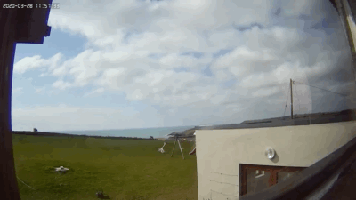
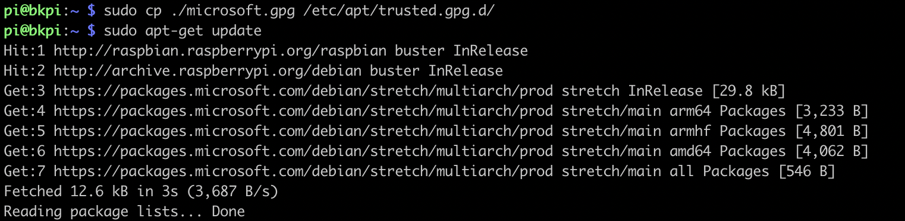

Looking back at picture of how the garden evolved throughout the spring and summer, I kept on thinking that a time-lapse of this would look incredible. 
I once did a time-lapse of the outside and you have to admit that looking at the clouds at that speed really makes a great sight and this is how the idea came to life.

So although the one about the garden is still in the works, following are instructions on how to automate daily time-lapses of your outside view.

Also we will be using a raspberry pi, IP camera and docker.

> I assume the raspberry pi to be already set up (nothing special, just accessible via ssh or that you can use the terminal).

> if you have a Pi Camera, feel free to use the following to take your pictures [doc for raspistill](https://www.raspberrypi.org/documentation/usage/camera/raspicam/raspistill.md).

[](https://youtu.be/oXuxmVnX5Og)

### Step2.1 - Install Docker on the Raspberry pi

Might be able to use this now: https://docs.microsoft.com/en-gb/azure/iot-edge/how-to-install-iot-edge-linux#install-the-container-runtime


```
curl https://packages.microsoft.com/config/debian/stretch/multiarch/prod.list > ./microsoft-prod.list
```

```
sudo cp ./microsoft-prod.list /etc/apt/sources.list.d/
```

```
curl https://packages.microsoft.com/keys/microsoft.asc | gpg --dearmor > microsoft.gpg
sudo cp ./microsoft.gpg /etc/apt/trusted.gpg.d/
```

```
sudo apt-get update
```



```
sudo apt-get install moby-engine
sudo apt-get install moby-cli
```


### Step 2.2 - Create folder structure and set up the cron

```
mkdir ~/timelapse
```

```
cd ~/timelapse
```

```
mkdir -p ~/timelapse/output/today
```

Let's create the script file to take that picture

```
nano ~/timelapse/takephoto.sh
```

Paste the following 

```
#!/bin/sh
today=`date '+%Y_%m_%d_%H%M_%S'`;
filename="/tmp/ffmpeg/picture_$today.jpg"

sudo docker run -v=/home/pi/timelapse/output/today:/tmp/ffmpeg —rm mhiro2/rpi-ffmpeg:3.3 -rtsp_transport tcp -i "rtsp://admin:<yourpassword>@<your iP of type 192.168.0.x>:554" -vcodec mjpeg -frames 1 $filename
```

#### Try it

```
~/timelapse/takephoto.sh
```

To test, check the output using 
```
ls ~/timelapse/output/today
```

>If you have an issue with permissions, I used the following but that may be too much actually : `sudo chmod a+rwx ~/timelapse/takephoto.sh`

If you can see a file, you can also download it to check what it looks like

```
scp [-P <port number>] pi@192.168.x.x:/home/pi/timelapse/output/taday/* .
```

Set up the crontab

```crontab -e``` 
>(I chose 1 for nano if you are asked to confirm because it is the first time you set up then cron)

On new line at the end, add:
```
* 07-18 * * * /home/pi/timelapse/takephoto.sh
```
... where we basically ask for that job to take a photo every minutes between 7am and 6.59pm.


You can then check a few pictures were taken using again the command 
```
ls ~/timelapse/output/today
```
<insert image>


### Making the time-lapse

```bash
nano ~/timelapse/move_and_convert_to_timelapse.sh
```

```bash

#!/bin/sh
today=`date '+%Y_%m_%d_%H%M_%S'`;
foldername=`date '+%Y_%m_%d'`;

filename="/tmp/ffmpeg/timelapse_$foldername.mp4"
targetFolder="/home/pi/timelapse/output/$foldername"

#Ensure the folder exists
mkdir -p $targetFolder

#Move today's pictures into a different folder
mv -f /home/pi/timelapse/output/today/* $targetFolder

#Rename all pictures
aa=0;for i in `ls $targetFolder/*`; do mv $i $targetFolder/`printf "%04d" $aa`.jpg; aa=$(($aa+1));done

#Create the time-lapse from the pictures
sudo docker run -v=$targetFolder:/tmp/ffmpeg mhiro2/rpi-ffmpeg:3.3 -r 30 -i /tmp/ffmpeg/%04d.jpg -r 10 -vcodec libx264 -vf scale=1280:720
```
