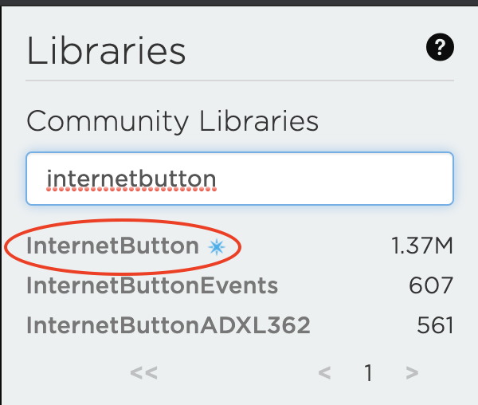
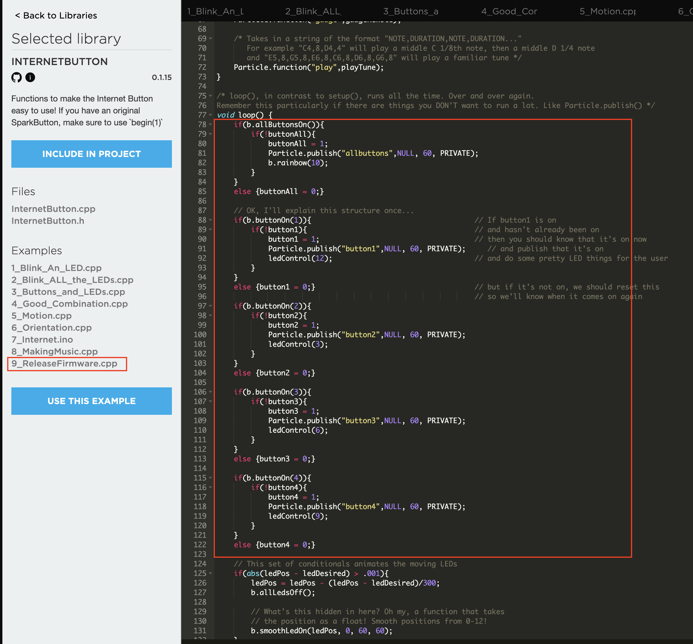
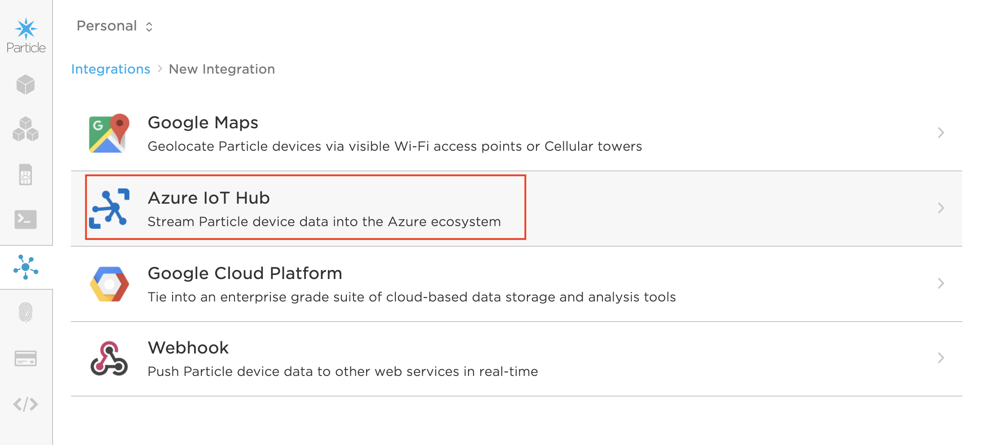
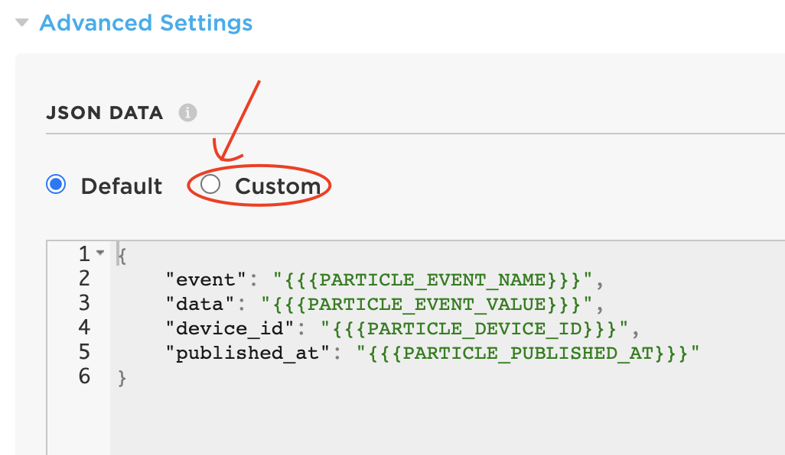

Particle internet buttons as IoT hub test data source.

Use a Particle internet button to create test data for your Azure IoT projects ...

# Context

On one of my recent IoT projects I needed a quick way to interact with IoT Hub to create test occupancy and temperature data. That was what fitted best my scenario but feel free to adapt this to your needs.

I recycled an unused Internet button once used for tracking (DevOps) builds, by setting up simple button clicks to:
- publish an event as occupied or available to the iot hub
- publish changes of temperatures to the IoT (increment temperature between two thresholds easily and update the LEDs to confirm)

# In short... 

The basic idea is to use the internet button sample that publishes different events on some of the button clicks and use the integration to send a custom payload. 

So you can click the different available buttons to trigger different payloads of test data

## Set up your device

To get started quickly with the most basic implementation, simply:
- look for the InternetButton library on the Particle Cloud (using https://build.particle.io)
- select the most "advanced" example (basically the last one number 9) - and flash it to your device.




## Configure the integration to IoT Hub




You can set whatever payload you want using handlebars (see [here](https://docs.particle.io/reference/device-cloud/webhooks/) for more documentation).

### Set the integration payload

Use it to set static or dynamic properties. 

#### Static payload

In the following example, ```IsOccupied``` is set to always send ```true```. You could consider sending false when clicking another button such:
- button1 -> occupied
- button3 -> free

```json
{
    "event": "{{{PARTICLE_EVENT_NAME}}}",
    "data": "{{{PARTICLE_EVENT_VALUE}}}",
    "device_id": "{{{PARTICLE_DEVICE_ID}}}",
    "published_at": "{{{PARTICLE_PUBLISHED_AT}}}",
    "IsOccupied": true
}
```

#### Dynamic payload

You could also customise the code to change a temperature property before it publishes an event such as:
- button2 -> decrement temperature by 1 degree and _then_ publish
- button4 -> increment temperature by 0.5 degree and _then_ publish

You would then use a similar json data template to this:

```json
{
    "temperature": "{{{temperature}}}"
}
```

If you are going to be handling json, I would recommend using [ArduinoJson](https://build.particle.io/libs/ArduinoJson) and publish using that json data. Checkout the examples for ways on how to use it - I personally used [this article](https://blog.particle.io/integrate-particle-with-azure-iot-central/) to get started quickly.

## Video

I go through that process in that video if that helps.

[](https://www.youtube.com/watch?v=30VliGVqnIg "Azure IoT Hub Test Data with Particle Button")

# So... 

- The above is a flexible base. We are giving a temperature or occupancy example, but you could also use it for any types of gauge simulation (battery level, signal strength, fuel tank level etc...)

- If you are working with third parties, you can easily simulate their payload via the Particle Cloud integration interface

You probably have all sort of test data generators lying around but I found this very practical for quick tests to check everything is going as expected, and simulating predefined sensor data during demos for perfectly times effects.
