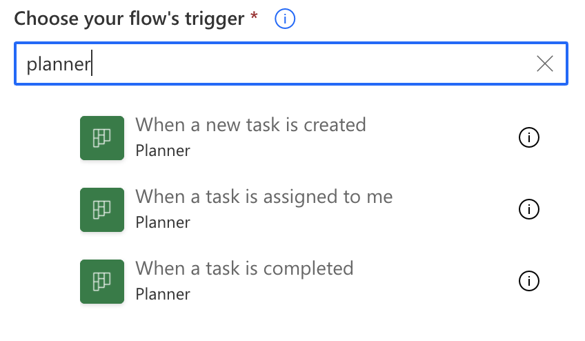
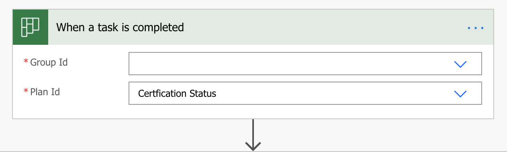
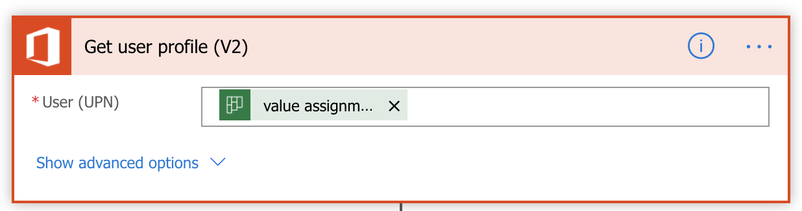
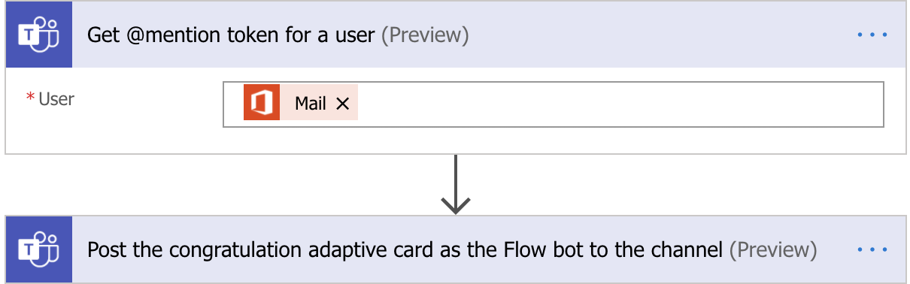
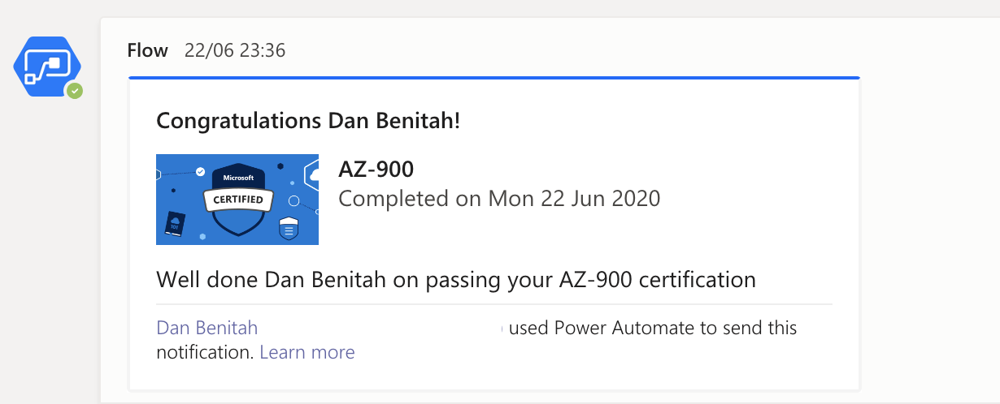

This year, my company had an Azure certification challenge and the team started to track people's certification status using planner. That helped them understand better who was planning to get what certification by which date and whether it was "completed".

Flow (or Power Automate) has a few available triggers and action for planner.

So while it does not offer anything (at the time of writing) when a task is updated (in our case the bucket was used to track status), it does offer a trigger when a task completes which is what we will be using here.

The scenario was to use flow to post an adaptive card to the related channel announcing to everyone someone had passed an exam and encourage discussion and praise(congratulations, tips, etc...).

While you may think of some other scenario to apply this to, this is what we used:

For the praise's adaptive card, you will likely want to design it here: https://adaptivecards.io/designer/.

You can also start from some of the examples at https://adaptivecards.io/samples/.

That has turned out to drive great engagement on the channel and almost fostered motivation to pass the exam and be the one to get the praise.

So far, the only issue has been that once a message has been posted as the Flow bot, it cannot be updated. So if the task was marked as completed in error, the post cannot be deleted.
So that certainly is something to update in the future.

Other possible improvements:
- Flow message to user on registration (creation of task) to help with resources linked to certification
- [Flow message on completion to confirm next steps](./2020-08-06-confirmation-in-your-flow.md) ("don't forget to register your cert at this link", "people usually do _this cert_ as the following exam"...)
- automation around reminders when date approaches (Planner has built in reminder already so whatever it does not cover :-P )
- auto suggestion on people to create a study group with
