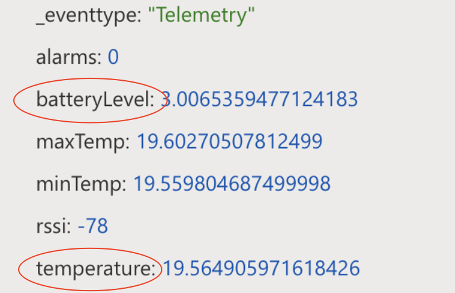
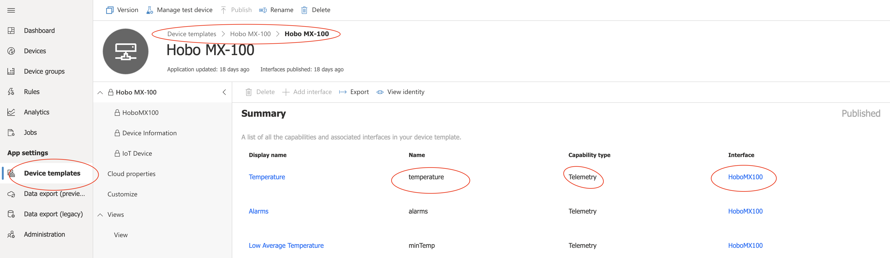
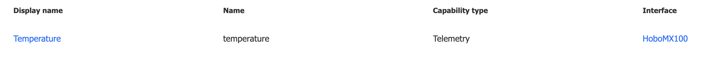
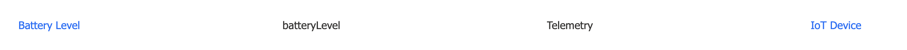

Quick one around querying IoTC Rest API to retrieve the last known values of some of your [Rigado](https://www.rigado.com/) connected sensors...



It starts with the device template which contains the important information:
- property name you are after
- property type
- property's interface name



Using the device id, we will then use the following to find out the interface name:

```
https://{{IOTC-name}}.azureiotcentral.com/api/preview/devices/{{deviceId}}/components
```

In my case it returns something like that:

```json
{
    "value": [
        {
            "@id": "urn:rigado:HoboMX100:HoboMX100:2",
            "@type": [
                "InterfaceInstance"
            ],
            "name": "HoboMX100",
            "displayName": "HoboMX100"
        },
        {
            "@id": "urn:rigado:HoboMX100:DeviceInformation_HoboMX100:1",
            "@type": [
                "InterfaceInstance"
            ],
            "name": "DeviceInformation_HoboMX100"
        },
        {
            "@id": "urn:rigado:HoboMX100:IoTDevice_HoboMX100:1",
            "@type": [
                "InterfaceInstance"
            ],
            "name": "IoTDevice_HoboMX100"
        }
    ]
}
```

We can then form the query to get our property value.

Temperature, for example, used the ```HoboMX100``` interface and was a telemetry property 


... so it will be requested like that:

```
https://{{iotcname}}.azureiotcentral.com/api/preview/devices/e25f2ace9e55/components/HoboMX100/telemetry/temperature
```

```
{
    "value": "12.73700287704178",
    "timestamp": "2020-08-03T22:47:42.442Z"
}
```

... while the battery Level was a telemetry from the IoT Device interface called ```IoTDevice_HoboMX100``` 



... so it will be requested like that:

```
https://{{iotcname}}.azureiotcentral.com/api/preview/devices/e25f2ace9e55/components/IoTDevice_HoboMX100/telemetry/batteryLevel
```

Curious to know you would use this for...


### References:
- https://docs.microsoft.com/en-us/learn/modules/manage-iot-central-apps-with-rest-api/
- https://docs.microsoft.com/en-us/rest/api/iotcentral/
- https://learning.postman.com/docs/sending-requests/variables/