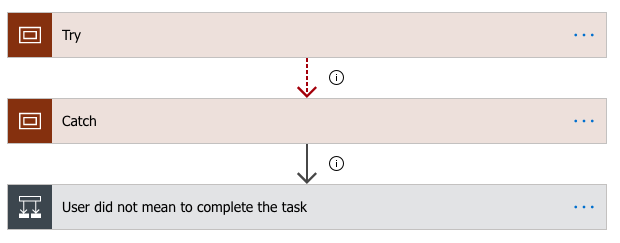
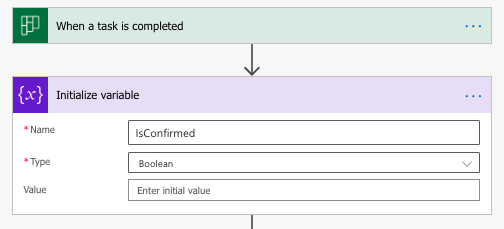
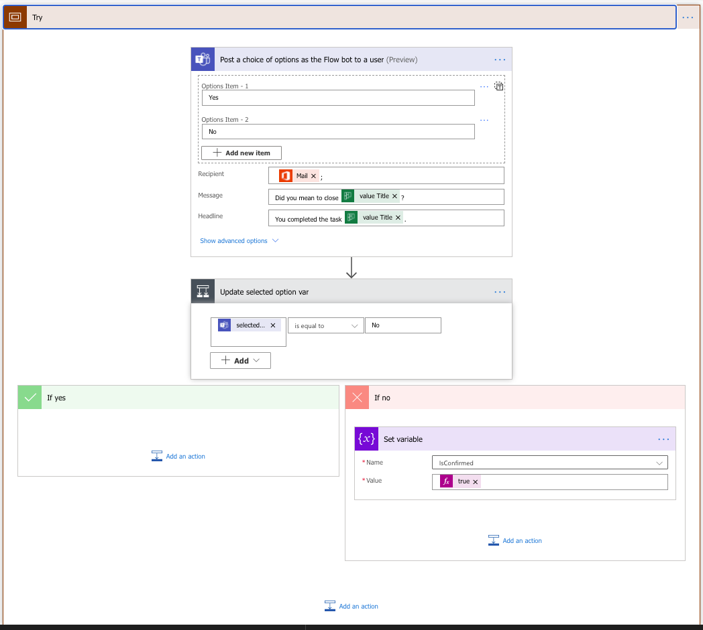
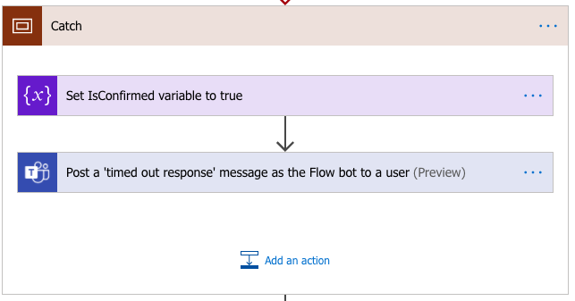
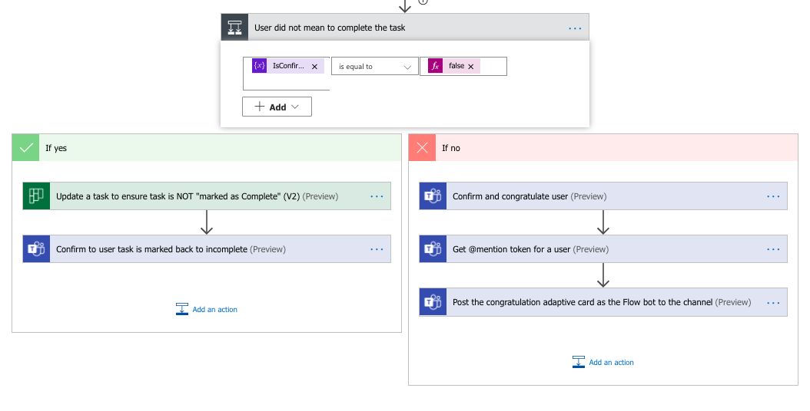

As discussed in my [previous post](./2020-08-04-using-flow-with-planner-for-praise.md), posting via flow immediatly after people would inadverdetly tick a box (which completes that task) would not allow deleting that message on the channel. So we needed to give a chance to people to correct that mistake before Flow would post that message.

The solution seemed to use a timeout. We wanted the post to happen pretty quickly after completion of the task, but like the "delay send" functionality in mailboxes, here we needed to say: "give it 5 minutes!".

It is possible to "configure run after" actions that activate on error, time out etc... When timing out, the whole flow was failing and it was not possible to go ahead and post anymore.

That is how I found out about the Try/Catch/Finally pattern and how to apply it to flow. In our case here, finally is not necessary.

##

Here we are using try/catch on the confirmation request and response or non response/time out. Should the user respond, we record his choice in a variable and act according to his response. Should it time out, we assume the completion was intentional and go ahead.

0. Initialise a variable to track the response

1. Try and get a response

2. Catch any issue

3. Send messages accordingly

## THAT's IT! (should work like a charm ;) 

I had issues getting the confirmation working (trial and error on the syntax), so I hope the screenshots help.

Thank you...

## Resources:
[Try Catch main reference](https://poszytek.eu/en/microsoft-en/office-365-en/powerautomate-en/try-catch-pattern-in-microsoft-flow/) 