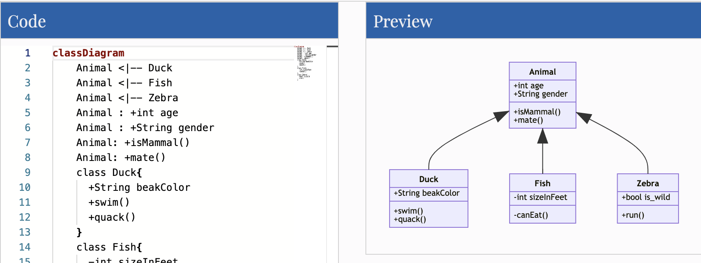
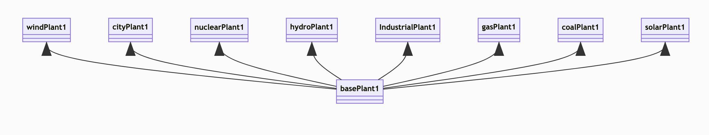
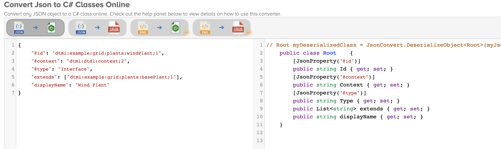
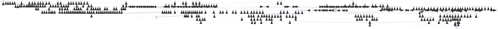
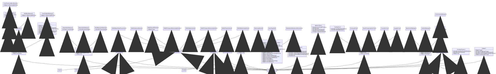

[Digital Twin Language Definition (DTDL)](https://github.com/Azure/opendigitaltwins-dtdl/blob/master/DTDL/v2/dtdlv2.md) is brilliant and helps standardize how to create your twin models and how they relate to each other. How about using it also to generate documentation in combination with mermaid?

[Mermaid](https://mermaid-js.github.io/mermaid/#/) "lets you represent diagrams using text and code". It makes it very easy to generate from what you are doing. Take a look at the samples in the [online editor](https://mermaid-js.github.io/mermaid-live-editor/) for reference.

I first heard of mermaid in the Azure DevOps context, but I really first started getting value out of it, by using the mermaid _flow chart_ to represent the digital twin graphs we would generate through an import process. We would therefore get visual confirmation of what had been imported (a bit like what [ADT Explorer](https://docs.microsoft.com/en-us/samples/azure-samples/digital-twins-explorer/digital-twins-explorer/) is now used for). 



However, I recently wondered how I could document the hierarchy I had in my _/Models_ folders alongside with the code, and got inspired by the _class diagram_ type of diagrams this time.
That would help visualise the inheritance (through DTDL's _extends_ property), and likely the main properties each model would each bring as part of their extendability.

DTDL defines that you can extend with up to 2 interface at the time of writing.



# How to generate the graph?

To get started quickly is very easy using dotnet core with the following steps:

1. Create a project
2. Add newtonsoft.json package
3. Use Json2csharp to get strongly typed classes of your models and import into your project
4. Iterate through your models and output as text the data (extendability and properties)
5. output to console and/or file
6. Generate diagram from output

## Set up the project

> Note the source code is available at https://github.com/danuw/AdtGraphModel and uses models from [ADT explorer](https://github.com/Azure-Samples/digital-twins-explorer/tree/master/client/examples) or [realestatecore ontology](https://github.com/Azure/opendigitaltwins-building/tree/master/Ontology) as examples.

### Create a new folder and browse to it.

```
mkdir AdtModelsGraph
cd AdtModelsGraph/
```

### Create the console app and add the Newtonsoft.Json nuget package.

```
dotnet new console
dotnet add package Newtonsoft.Json
```

### (optionally) Make sure it all compiles and carry on...
```
dotnet build
```

## Generate the classes



Using a combination of your models you may end up with the following classes using json2csharp.com.

```csharp
  public class Property    {
      public string name { get; set; } 
      [JsonProperty("@type")]
      public string Type { get; set; } 
      public string schema { get; set; } 
  }

  public class Content    {
      [JsonProperty("@type")]
      public string Type { get; set; } 
      public string name { get; set; } 
      public object schema { get; set; } 
      public bool? writable { get; set; } 
      public string displayName { get; set; } 
      public List<Property> properties { get; set; } 
  }

  public class Root    {
      [JsonProperty("@id")]
      public string Id { get; set; } 
      [JsonProperty("@type")]
      public string Type { get; set; } 
      public string displayName { get; set; } 
      [JsonProperty("@context")]
      public string Context { get; set; } 
      public List<Content> contents { get; set; }
      public List<string> extends { get; set; } 
  }

```

## Extract the data in a mermaid format

Looking back at the examples, we can construct that graph using the following steps:
 1. start with `classDiagram` and subsequently use correct indentation for the connections
 2. Inheritance connections for classes (which we will use for DTDL interfaces) are represented with this pattern `Class1 <|-- Class2` as in `Vehicule <|-- Car` or `Animal <|-- Chicken`
 3. Properties use this pattern `Class1 : +PropertyType PropertyName` such as `Vehicule : +Integer NumberOfWheeels`
 4. Methods (which we will use for relationships) use this pattern `Class1 : +MethodName()` such as `Vehicule : +MoveForward()` and in our case `Building : +contains()`

So, first, make sure you add the Newtonsoft.Json in the usings, although  you will be needing the following ones:
```csharp
using System;
using System.Collections.Generic;
using System.IO;
using System.Text;
using System.Text.Json;
using Newtonsoft.Json;
```

Then lets create these connections between classes, and list the contents.

```csharp
static void Main(string[] args)
{            
    Console.WriteLine("Hello World!");

    var currentDir = Directory.GetCurrentDirectory();
    var docPath = Path.Combine(currentDir, "Models");

    var models = Directory.EnumerateFiles(docPath, "*.json", SearchOption.AllDirectories);

    var sb = new StringBuilder();
    var sbProps = new StringBuilder();
    sb.AppendLine($"classDiagram");

    // Step 1 : Iterate through each model and save model id and relatioinship in mermaid format
    foreach (var m in models)
    {
        var myJsonString = File.ReadAllText(m);
        var model = JsonConvert.DeserializeObject<Root>(myJsonString);
        
        // Step 1.a : Record the inheritance
        if(model.extends !=null)
        {
            foreach (var e in model.extends)
            {
                sb.AppendLine($"    {GetName(model.Id)} <|-- {GetName(e)}");
            }
        }
        else // In cases where a model does have any inheritance so we can add properties to an existing "class"/model (and avoid errors)
        {
            sb.AppendLine($"    class {GetName(model.Id)}{{");
            sb.AppendLine("    }");
        }

        // Step 1.b: If there are properties, record them for that "class"
        if(model.contents == null)
            continue;

        foreach (var c in model.contents)
        {
            var s = c.schema as string;
            if(c.Type.Contains("Relationship") )
            {
                sbProps.AppendLine($"    {GetName(model.Id)} : +{c.name}()");
            }
            else if(s == null || s.Contains("{") || s.Contains(":")){ // Complex type, simplified as "Object" for now
                sbProps.AppendLine($"    {GetName(model.Id)} : +Object {c.name}");
            }
            else
            {
                sbProps.AppendLine($"    {GetName(model.Id)} : +{c.schema} {c.name}");
            }   
        }
    }

    // Step 2 : Output the results
    var mermaidPath = Path.Combine(currentDir, "mermaid.mmd");
    Console.WriteLine(mermaidPath);

    // output all the recorded connections to create a mermaid graph of the relationships
    var mermaid = sb.ToString() + sbProps.ToString();
    Console.WriteLine(mermaid);

    // Save it to file to view in a mermaid (pre-)viewer.
    File.WriteAllText(mermaidPath, mermaid);

    Console.WriteLine($"Mermaid saved to {mermaidPath} ");
}
  
```
Above, we only differentiate between _Property_ and _RelationShip_ in contents. I may in the future, start to differentiate between _Property_ and _Telemetry_ as this is easily missed difference at first.

Finally, model id characters are not accepted so here we are simplifying the names by removing the domains and keeping the version, but this should be adapted to the complexity of your scenario.

```csharp
    static string GetName(string id){
        var position = id.LastIndexOf(":");// I believe that charater is mandatory so no extra check needed here to ensure it does not fail (safe assumption)
        id = id.Substring(position+1);// removing the domain info from id
        return id.Replace(";", "");// removing the ';'and keeping the version
    }
```

Find the complete code at [https://github.com/danuw/AdtGraphModel](https://github.com/danuw/AdtGraphModel).

## Convert to diagram

Finally, visualise the converted diagram using some of the many options such as [mermaid-cli](https://github.com/mermaid-js/mermaid-cli), or one of the mainly previewing extensions in VS code for example. An easy one remains the [online editor at https://mermaid-js.github.io/mermaid-live-editor/](https://mermaid-js.github.io/mermaid-live-editor/). You can also use the npm package ([try npx version of the cli for a quick and clutter free test](https://github.com/mermaid-js/mermaid-cli#run-with-npx) to install packages and execute on the fly), to generate a transparent svg and/or complete the automation of getting your relationships into a diagram locally.

# Finally...
Whether you were asked, or you simply needed it for yourself, this should now give you a great way to document your models going forward.

This is especially useful when you want to make some updates and refactor/refine models' inheritance and/or properties.

This is still a very basic implementation though, which, for example, does not cover complex data types, so feel free to [help extend it](https://github.com/danuw/AdtGraphModel).






### References:
- Mermaid online editor at https://mermaid-js.github.io/mermaid-live-editor/
- Example models from:
  - ADT explorer at 
  - Azure RealEstate Ontology at https://github.com/Azure/opendigitaltwins-building/tree/master/Ontology