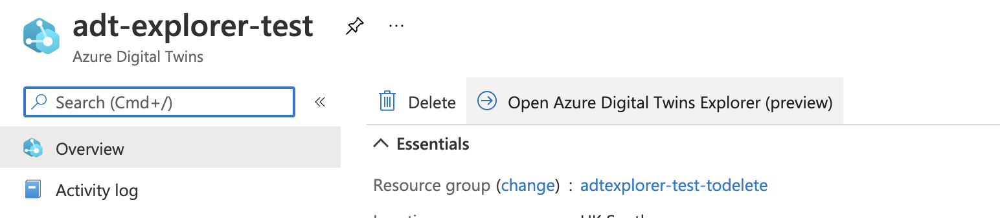

Since last summer, a great tool was made available to easily browse Azure Digital Twins v2's graph called the ADT Explorer.

First and foremost, it allowed you to visualise your graph, and for those who tried, this was absolutely crucial in validating it all made sense (e.g. to identify "orphans" for missed relationships - are all floors linked to a building, all occupancy sensors links to a desk etc...).

It also allowed for some editing capabilities, such as the ability to import a graph or models, create twins and relationships. It was especially useful to be able to edit basic properties on the fly (for testing or demo purposes).

To run that tool though, you either could do it locally (which I mainly relied upon), or deploy your own instance (including some configuration for each instance).



They have now announced a publicly available instance at https://explorer.digitaltwins.azure.net/ as well as run through of its awesome latest capabilities, such as:
- filtering the loaded graph: for big instances, it used to take a while to load a full graph (all nodes and relationships), it now seems to load much faster and simply allows to more easily single out or highlight some nodes or groups of nodes from these key words


- model graph: which similar to what I started doing [here](/dtdl-models-inheritance) enables straight in the explorer to visualise relationships between models 


I am really excited about how these new features will improve my productivity and the productivity of my teams and colleagues. 

Be sure to keep an eye on the [enhancement requests](https://github.com/Azure-Samples/digital-twins-explorer/issues?q=is%3Aopen+is%3Aissue+label%3Aenhancement) and/or contribute for these to come to life faster :)

One more things...


In the event you get an unauthorized error and are not able to change the directory (blank list) as shown below, there is currently a work around by using the following URL format:

```shell
https://explorer.digitaltwins.azure.net/?tid=<TENANT_ID>&eid=<ADT_HOSTNAME>
```

### References:
- https://explorer.digitaltwins.azure.net/
- IoT Show episode: https://youtu.be/qbs6XRlIxes
- ADT explorer repo : https://github.com/Azure-Samples/digital-twins-explorer